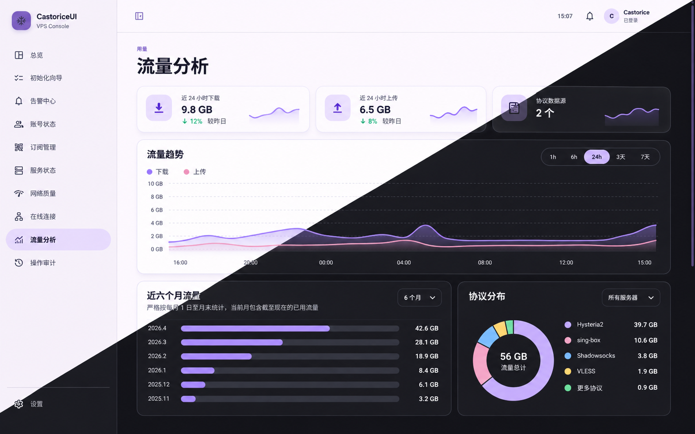

# Material-Design CastoriceUI


一套采用 Material Design 3 的轻量 VPS 代理管理面板，包含响应式前端、初始化向导和可选的 Python 标准库后端。它可以统一展示主机资源、Hysteria2、AnyTLS / sing-box、连接、流量、网络质量、证书、告警与审计信息。

A lightweight Material Design 3 VPS proxy console with a responsive frontend, guided integrations, and an optional Python standard-library backend. It provides one place for host metrics, Hysteria2, AnyTLS / sing-box, connections, traffic, network quality, certificates, alerts, and audit events.



<p align="center">
  
</p>

[中文](#中文) · [English](#english)

## 中文

### v1.4 真实性与状态修复

- 首屏先显示中性加载状态，不再在真实后端响应前闪现示例服务器数字。
- 后端中断时保留最后成功快照，但明确标记“已停止更新”和快照时间，不再继续声称实时。
- Hysteria2 活动流和 sing-box 连接统一称为“活动连接条目”，不再误称独立在线设备。
- 协议核心未返回速率、来源 IP 或开始时间时显示“核心未提供”，不再使用 `0` 或当前时间补造。
- Hysteria2 / sing-box 的运行态取决于当前 API 响应；仅填写地址不再显示为已连接。
- 系统自动更新状态改为读取 `unattended-upgrades` 与 `apt-daily-upgrade.timer`，系统版本来自 `/etc/os-release`。
- 订阅记录明确属于受保护的服务器配置；HTTPS 格式校验不代表发布器可达或已验证。
- 网络探测明确标注最多缓存 5 分钟；月度流量继续明确以首个保留采样为基线。

### 主要功能

- 总览：已用/剩余流量、预计耗尽、CPU、内存、磁盘、负载、实时上下行
- 初始化向导：按服务展示配置目的、操作步骤、参数输入与验证结果
- 向导草稿：页面间切换不丢失，刷新或关闭页面后自动清除未提交内容
- 接入状态：区分未配置、配置成功、当前可用和已配置但运行异常
- 账号、在线连接、流量分析、订阅、网络质量、服务、告警与审计九个页面
- 各页面包含简明的能力说明，方便首次部署者理解数据来源和安全边界
- 侧栏与设置中均可显示/隐藏初始化向导，并支持浅色、深色、跟随系统和十组主题色
- 后端快照状态位于侧栏底部；总览网络卡片显示质量等级、可达目标和探测结果
- 账号、连接、服务等只读页面不再展示无法真正执行的伪操作按钮
- 桌面、平板、手机响应式布局与无障碍弹窗/键盘导航
- 接入配置只有在真实上游鉴权请求成功后才会标记为就绪，失败配置不会持久化
- Hysteria2 / sing-box 管理地址只接受 localhost 或回环 IP，阻止公网、内网和云元数据地址
- 上游 Secret 仅从服务器 `0640` 配置读取，不经浏览器提交、不写入 SQLite；启动时清理 v1.2 遗留值
- 预览模式使用持续可见的“示例数据”提示，演示状态不再伪装成真实运行或验证成功
- Nginx、systemd、版本化目录、认证、用户/组和回滚文档已统一为可复现的安全部署流程

### 后端能力

`server/` 提供不依赖第三方 Python 包的数据服务：

- `/proc`、`/sys`、`statvfs`：CPU、内存、磁盘、负载、运行时间和网卡计数器
- Hysteria2 Traffic Stats API：账号累计流量、在线计数和活动流条目
- sing-box Clash API：AnyTLS 连接、来源地址和累计流量
- `systemd` 与证书读取：核心状态、版本、运行时间和证书有效期
- IPv4 / IPv6 并发探测：延迟、抖动和丢包
- SQLite：流量采样、设置、告警确认和操作审计

管理 API 默认只监听 `127.0.0.1`，由 Nginx 通过同源 `/api/` 转发。协议 API 也应只监听回环地址，并使用独立随机密钥。浏览器不会收到上游 API Secret、配置文件、私钥或明文密码。

开源仓库、示例数据和 README 截图只使用文档保留地址与虚构账号。登录后的私有部署默认显示协议核心实际返回的账号、来源 IP 和审计来源，便于管理；如需演示环境，可设置 `redact_live_data: true`。无论该选项如何，常规仪表盘响应都不会包含完整订阅 URL、Token、上游 API Secret、配置文件、私钥或明文密码。复制地址和二维码只在管理员主动操作时从受保护端点按需读取。

### 快速预览

需要 Node.js 20.19 或更高版本：

```bash
git clone https://github.com/Kokomi-maomeng/Material-Design-CastoriceUI.git
cd Material-Design-CastoriceUI
npm ci
npm run dev
```

打开 `http://localhost:5173`。未启动后端时会使用带有持续提示的内置示例数据；向导可以演示交互，但不会声称已经保存或验证真实配置。

### 完整检查

```bash
npm run check
```

该命令依次执行 ESLint、TypeScript、前后端测试、敏感信息扫描、生产构建和生产依赖审计。

### 生产部署

生产部署不是单条复制命令：必须先建立版本化回滚目录、专用用户与 `proxycert` 组、受限配置文件、TLS 和覆盖前端及 `/api/` 的认证。请完整执行 [`docs/DEPLOYMENT.md`](docs/DEPLOYMENT.md)，并使用默认启用认证且指向 `current` 发布目录的 [`deploy/nginx.conf.example`](deploy/nginx.conf.example)。升级时保留现有私有配置和数据库，不要用示例文件覆盖。

### 数据准确性边界

- 网卡流量从后端首次运行时开始建立月度基线，不能恢复部署前未记录的历史采样。
- 页面每 5 秒刷新后端快照；网络 ICMP 探测最多缓存 5 分钟，二者不是同一采样频率。
- Hysteria2 可以提供账号级统计；sing-box 当前接口主要提供连接与聚合统计，能否映射到账号取决于核心返回字段。
- Hysteria2 Traffic Stats 活动流包含认证账号，但当前接口不保证返回客户端来源 IP；缺失时页面会明确显示“协议核心未提供”，不会把访问目标误标为来源地址。
- 活动流或连接条目不是独立设备计数；协议核心没有提供瞬时速率或连接开始时间时，面板不会自行推算。
- 面板不会直接执行任意 shell 命令。协议账号写入、认证迁移等高风险操作应通过经过审计的专用适配器实现。
- Basic Auth 可用于单管理员部署；多人环境建议换成带会话、CSRF 和 MFA 的认证代理。

### 项目结构

```text
app/                    Material Design 3 样式与设计令牌
components/             页面、图表、向导和 UI 组件
lib/                    类型、API 客户端、预览数据和接入定义
server/castoriceui/     Python 后端、采集器、SQLite 与 HTTP API
deploy/                 systemd 和 Nginx 示例
docs/                   部署、接入与设计文档
tests/                  前端边界测试
```

### 安全

提交前运行 `npm run check`。不要提交 `.env`、真实服务器地址、用户名、密码、订阅 Token、Cookie、API Secret、私钥或证书。示例只能使用 `example.com` / `example.test` 和文档地址。

安全问题请参阅 [`SECURITY.md`](SECURITY.md)，贡献流程见 [`CONTRIBUTING.md`](CONTRIBUTING.md)。

## English

### What v1.4 fixes

- Neutral loading state before the first backend response; demo metrics no longer flash during production startup
- Explicit stale-snapshot state after a backend disconnect, including the last successful timestamp
- Activity streams and connection records are no longer mislabeled as independent online devices
- Missing source IP, instantaneous rate, or start time is shown as unavailable instead of being fabricated
- Runtime adapter health is derived from current authenticated API responses, not configuration presence
- Automatic-update state comes from systemd, subscription URLs are described as configured records, and network-probe caching is disclosed

### Main capabilities

- Live overview for quota, forecast, CPU, memory, disk, load, and network rates
- Guided integration cards with purpose, ordered steps, parameter forms, and verification state
- Session-only form drafts that survive page navigation but disappear after a reload
- Integration gates on every functional page; completed services move below pending setup items
- Accounts, connections, traffic, subscriptions, network, services, alerts, and audit views
- Concise capability explanations for every page
- Setup visibility controls in both the sidebar and settings, light/dark/system modes, and ten color themes
- Sidebar live-data status, network quality grades, and resilient service-version rendering
- Read-only views omit controls that cannot perform a real backend operation
- Responsive desktop, tablet, and mobile navigation
- Authenticated upstream probes before an integration can become ready
- Strict loopback-only management endpoints to block internal, public, and cloud-metadata targets
- Server-config-only upstream Secrets, with no browser or SQLite persistence and automatic v1.2 cleanup
- Persistent preview-mode labeling that never presents demo data as a live or verified server
- Reproducible authenticated Nginx, systemd account/group, versioned-release, and rollback documentation

### Backend

The optional backend under `server/` uses only the Python standard library and SQLite. It collects Linux resource counters, Hysteria2 Traffic Stats, sing-box Clash connection data, systemd health, certificate expiry, network probes, traffic history, alerts, and audit events.

The API listens on loopback by default and is exposed only through the authenticated same-origin `/api/` reverse proxy. Upstream secrets, raw configuration files, private keys, and plaintext passwords are never returned to the browser.

Repository examples and screenshots remain documentation-safe. A private authenticated deployment shows the real account, source IP, and audit identifiers returned by its adapters by default; operators can opt into presentation masking with `redact_live_data: true`. Subscription URLs and tokens remain excluded from the dashboard payload in both modes. A protected endpoint returns a URL only for an explicit copy or QR action, and the QR value is cleared from page memory when the dialog closes.

### Development

```bash
git clone https://github.com/Kokomi-maomeng/Material-Design-CastoriceUI.git
cd Material-Design-CastoriceUI
npm ci
npm run dev
```

Open `http://localhost:5173`. Without a backend, the UI starts in clearly labeled preview mode. The workflow remains testable, but it does not claim to save or validate a real service.

Run all checks and create the production build:

```bash
npm run check
npm run build
```

See [`docs/DEPLOYMENT.md`](docs/DEPLOYMENT.md) for the backend, systemd, Nginx, TLS, validation, and rollback workflow. See [`docs/INTEGRATION.md`](docs/INTEGRATION.md) for the API and adapter boundary.

### Compatibility

- ES2017 browser target with clipboard, storage, and media-query fallbacks
- Locally bundled fonts and Material Symbols; no runtime font CDN
- Lazy-loaded pages and lightweight SVG charts
- Maintained Chrome, Edge, Firefox, Safari, and their mobile variants
- Python 3.11+ and a systemd-based Linux host for the optional backend

### License

[MIT](LICENSE)
