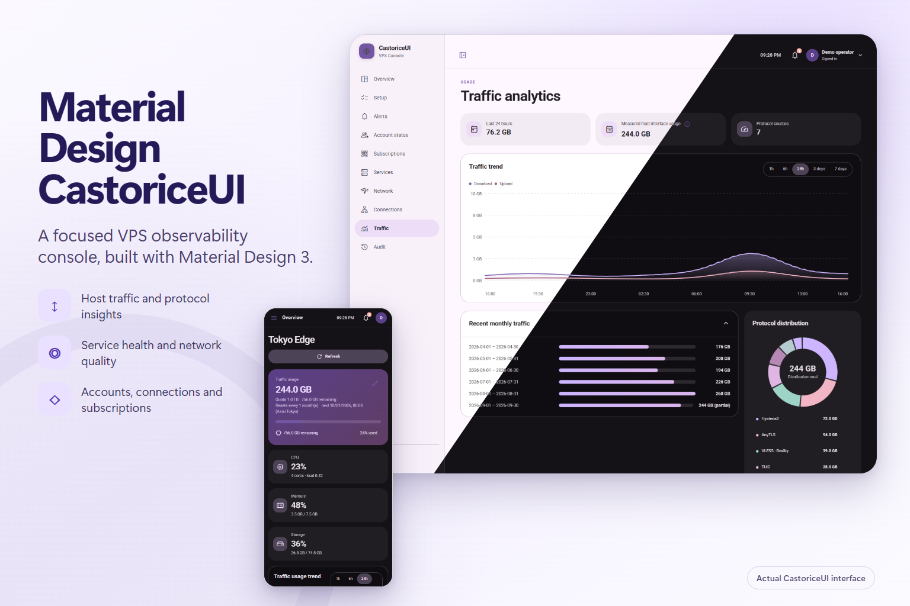
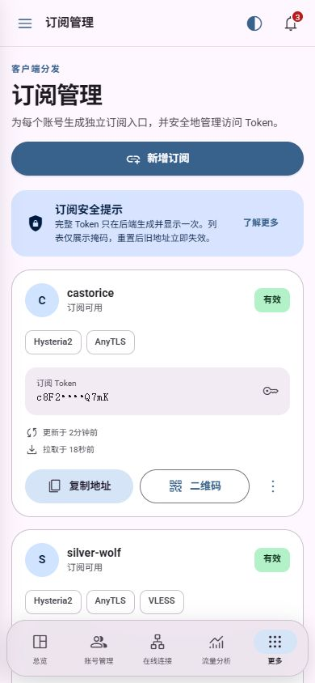

# CastoriceUI


CastoriceUI 是面向 Linux VPS 的 Material Design 3 可观测控制台，用于集中查看主机资源、真实网卡流量、代理连接、网络质量、服务状态、订阅记录、告警与审计信息。

项目由 React 前端和轻量 Python/SQLite 后端组成。后端仅需接入本机数据源，浏览器不会直接访问协议管理接口，也不会用模拟数据替代不可用的生产数据。



<details>
<summary>移动端导航（390 × 844）</summary>



</details>

> 截图来自真实运行页面并启用脱敏，不包含密码、Token、完整订阅地址或未处理的生产身份信息。

## 功能范围

- Linux 主机 CPU、内存、磁盘、负载、运行时间及网卡计数器
- 1 小时至 7 天的流量趋势、跨重启增量账本、默认关闭或按日/周/月/年自定义的额度重置周期
- 在线连接、连接速率、来源与目标信息（以协议核心实际输出为准）
- IPv4/IPv6 网络质量探测、服务健康、告警确认及操作审计
- 首次安全初始化、应用登录、会话与 CSRF 防护、界面与面板设置
- 响应式桌面与移动端布局、浅色/深色主题及减少动态效果支持

## 协议接入

| 数据源 | 当前支持 |
| --- | --- |
| Hysteria2 | Traffic Stats API 的累计流量、在线计数与活动流 |
| sing-box | AnyTLS、VLESS、XTLS Vision、Reality、SOCKS5、Shadowsocks、VMess、Trojan、TUIC |

sing-box 连接仅按服务器配置中的 inbound tag 明确映射。未匹配的连接不会被猜测为某个协议；Reality 作为 VLESS 的 TLS 安全配置展示，而不是独立协议。

## 本地开发

需要 Node.js 20.19+ 与 Python 3.11+：

```bash
git clone https://github.com/Kokomi-maomeng/Material-Design-CastoriceUI.git
cd Material-Design-CastoriceUI
npm ci
npm run check
npm run dev
```

单独启动前端时，如果后端不可用，页面会显示连接状态，不会生成演示流量。完整接口约定见 [`docs/INTEGRATION.md`](docs/INTEGRATION.md)。

## 生产部署

生产环境建议使用 systemd、Nginx 与有效 TLS。CastoriceUI 后端、Hysteria2 Traffic Stats API 和 sing-box Clash API 均应只监听回环地址，由 Nginx 同源提供网页与 `/api/`。

部署与升级步骤见 [`docs/DEPLOYMENT.md`](docs/DEPLOYMENT.md)。升级前应备份受保护配置、完整的 `state.db*`、当前前后端目录、systemd 单元和 Nginx 站点，并保留可验证的回滚版本。

安全边界及漏洞报告方式见 [`SECURITY.md`](SECURITY.md)，贡献要求见 [`CONTRIBUTING.md`](CONTRIBUTING.md)，本次发布说明见 [`docs/RELEASE_NOTES_v3.0.0.md`](docs/RELEASE_NOTES_v3.0.0.md)。

## English

CastoriceUI is a Material Design 3 observability console for Linux VPS hosts. It combines host metrics, real interface traffic, proxy connections, network quality, service health, subscriptions, alerts, and audit records in a responsive interface.

The React frontend uses a lightweight Python/SQLite backend. Hysteria2 is integrated through its Traffic Stats API. sing-box connections are classified only through explicit inbound-tag mappings for AnyTLS, VLESS/XTLS/Reality, SOCKS5, Shadowsocks, VMess, Trojan, and TUIC.

For local development, run `npm ci`, `npm run check`, and `npm run dev`. For production, follow [`docs/DEPLOYMENT.md`](docs/DEPLOYMENT.md) and keep every backend or protocol-management endpoint on loopback behind same-origin Nginx and TLS.

## License

[MIT](LICENSE)
